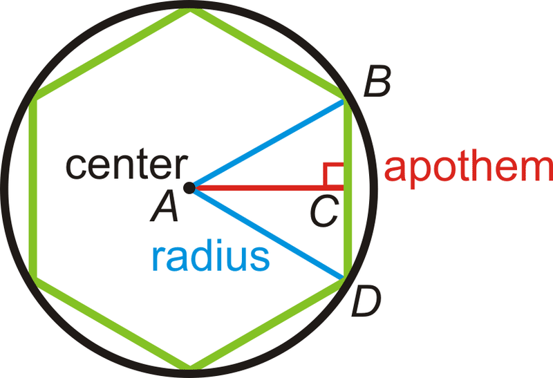

## Objective: Iterables and Iterators

1. A regular strictly convex polygon is a polygon that has the following characteristics:
    - all interior angles are less than 180
    - all sides have equal length
    

    
    

2. For a regular strictly convex polygon with:
    - n edges (=n vertices)  
    - R circumradius  
    - 𝑖𝑛𝑡𝑒𝑟𝑖𝑜𝑟𝐴𝑛𝑔𝑙𝑒=(𝑛−2)⋅180𝑛
    - 𝑒𝑑𝑔𝑒𝐿𝑒𝑛𝑔𝑡ℎ,𝑠=2⋅𝑅⋅sin(𝜋𝑛)
    - 𝑎𝑝𝑜𝑡ℎ𝑒𝑚,𝑎=𝑅⋅cos(𝜋𝑛)
    - 𝑎𝑟𝑒𝑎=1/2⋅𝑛⋅𝑠⋅𝑎
    - 𝑝𝑒𝑟𝑖𝑚𝑒𝑡𝑒𝑟=𝑛⋅𝑠
     

      
        

### Goal 1

Refactor the `Polygon` class so that all the calculated properties are lazy properties, i.e. they should still be calculated properties, but they should not have to get recalculated more than once (since we made our `Polygon` class "immutable").

### Goal 2

Refactor the `Polygons` (sequence) type, into an **iterable**. Make sure also that the elements in the iterator are computed lazily - i.e. you can no longer use a list as an underlying storage mechanism for your polygons.

You'll need to implement both an iterable, and an iterator.
